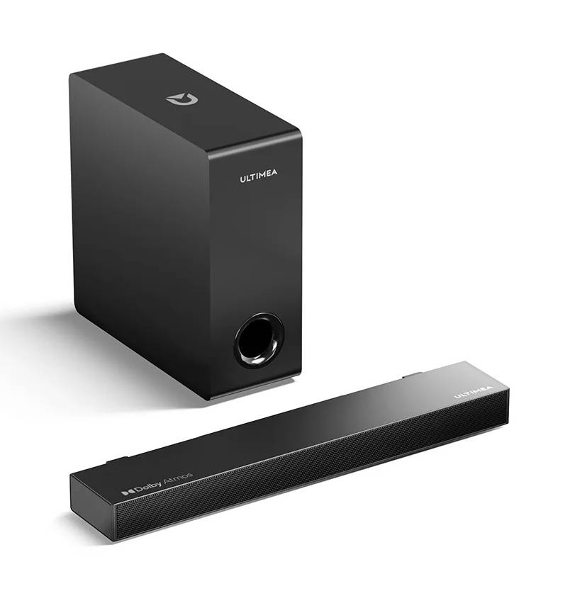
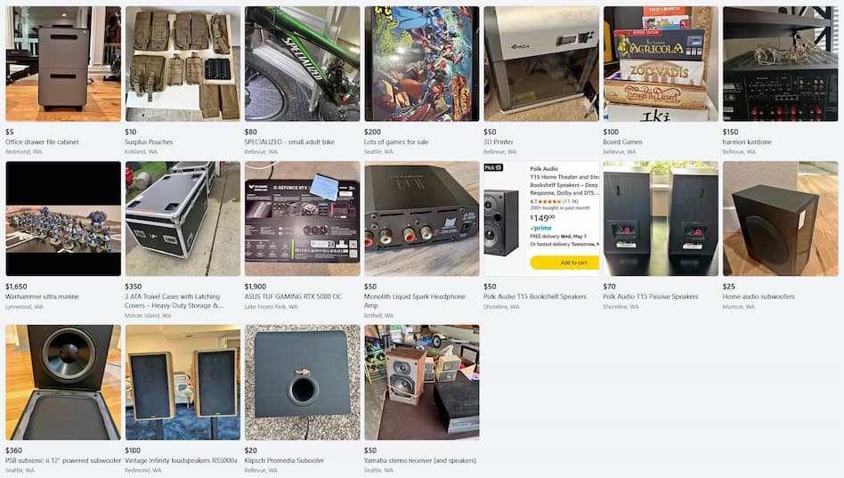
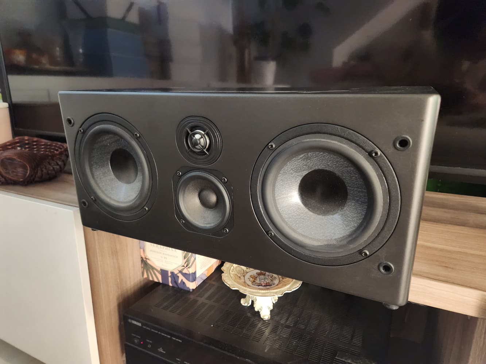
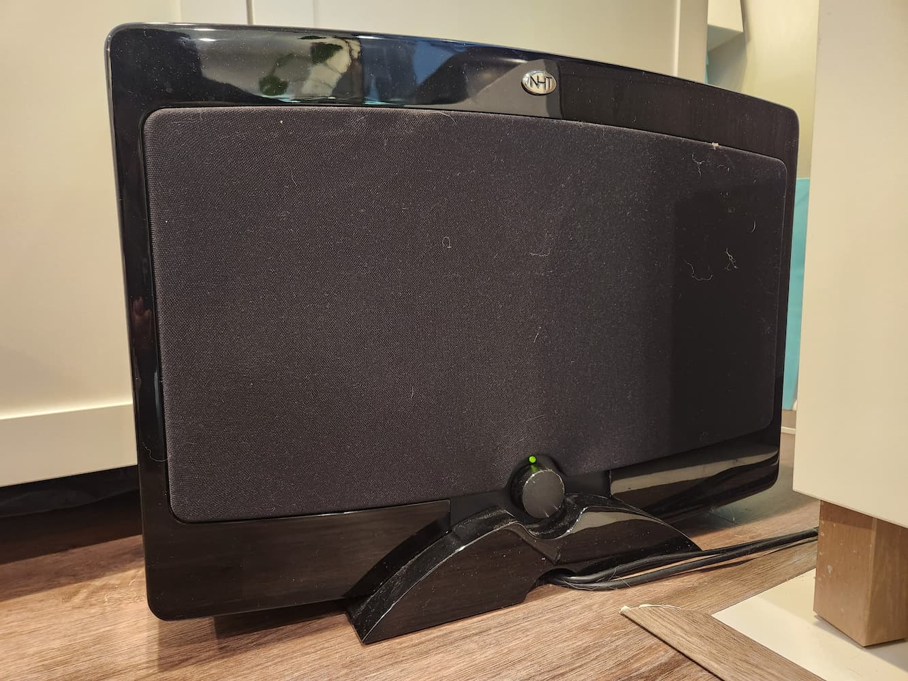
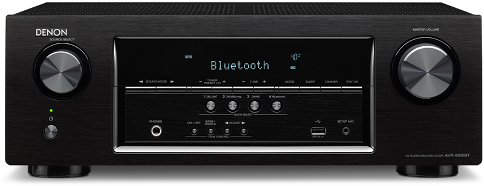

<i>So I did. It cost more than I thought.</i>

Movie nights at our place were frequently troublesome. Without fail people would say:

- Can we turn on subtitles?
- Can you make it louder? We can't understand what they're saying
- It's too loud, can you turn it back down?

Movie night was never a straightforward _sit down and enjoy the show_ experience. I would _always_ have to fuss and tinker throughout watching. I was always on alert to manage the volume, and would never be 100% focused on the movie.

This is the sound bar I had. It cost me $110USD including sales tax, and it sucks. Even when I wasn't fussing with the volume, listening to the sound bar felt like plasticky cheap defeat. Sometimes you could hear dialog come out of the pathetic 5-inch "subwoofer" instead of the sound bar. It has 4.2 ⭐ on Amazon and in my opinion it deserves to be around 3 ⭐.

So it felt serendipitous that Linus Tech Tips released the following video: _I Built an INSANE Surround Sound Setup for Under $250_.

<iframe width="560" height="315" src="https://www.youtube.com/embed/u4LFDPbbSVk?si=o3B-mEfXjgwf7QfI" title="YouTube video player" frameborder="0" allow="accelerometer; autoplay; clipboard-write; encrypted-media; gyroscope; picture-in-picture; web-share" referrerpolicy="strict-origin-when-cross-origin" allowfullscreen></iframe>

A promise of better audio for just a few hundred dollars? Or even just $40 for a noticeable improvement? I formulated a basic plan: find second hand speakers and an AV receiver nearby, for up to a few hundred dollars. Surely anything at all would be better than what I had now.

I opened up Facebook marketplace and began browsing. My brother-in-law spotted my laptop screen full of speakers, exclaiming loudly:

> "Yes, PLEASE buy some new speakers."

## Second hand means a chance of failure, and no returns

In Linus' video, every speaker and part he bought seems to work. For me, over the course of my three week audio journey I bought _three_ defective items:

- a subwoofer that was too quiet to practically use
- a receiver that turned on but didn't make any sound
- a receiver that worked great at first but failed soon after

These kinds of failures are difficult or impossible to detect when buying. After my first failed purchase, I endeavoured to ask every seller to test every item. But 2 out of 3 refused, saying that the time is not worth it for such cheap items.

Additionally, for 95% of defective items, sellers won't refund you.

Then there's the wasted time. Many many hours were wasted on:

- communicating with the sellers of these devices about the initial purchase
- driving to pick up stuff
- diagnosing and attempting to fix these devices
- attempting to negotiate refunds, and failing
- looking for replacements
- disposing of dead equipment - I went to a nearby electronics recycling event

3 out of 12 items I bought were failures - a 25% failure rate is shockingly high and a legitimate reason for people to not want to deal with second hand goods.

## Second hand audio costs less than new, but more than you'd think

Then there's the wasted money - the above is around $100 of gear that didn't work out for me. Also, Linus did not mention was the cost of buying wire and cables. It's not much, but at these price ranges, new speaker wire is a non-trivial fraction of the budget. My spending is broken down below:

| Cost    | Item                                   |
| ------- | -------------------------------------- |
| $100    | Onkyo 7.1 system                       |
| $11     | RCA cable                               |
| $20     | Yamaha receiver                        |
| $80     | NHT monitor                            |
| $80     | NHT subwoofer                          |
| $7.59   | Right angle power cable for subwoofer  |
| $26.51  | Pure copper speaker cable (100 feet)   |
| $50     | Denon receiver                         |
| $375.10 | Total                                   |

Of all this, around $126 was total waste. But even at $375.10, I'm still much happier with my final setup than an off-the-shelf soundbar - it just wasn't as cheap as I thought it would be.

## Home theatres take a lot of space

Space is a huge cost I didn't think about. The speakers, receiver, and subwoofer take up quite a lot of space. I had enough room, but my wife did comment on the floor space she lost to the subwoofer, and space she lost on the entertainment unit to the receiver and speakers, so she can no longer place her pretty plants there.

I also have a huge spool of speaker wire that in all likelihood, I will never use, just taking up space in the garage.

## The end result - they sound great and cost less than new

Even with all the extra challenges of buying second hand, I'm extremely pleased with the result.

The star of the show is the NHT M5 monitor, which I'm using as a centre channel speaker.

The next star is the subwoofer, a NHT Verve subwoofer with two 10 inch woofers.

Then there's the receiver, a Denon AVR-S510BT receiver.

Finally, I have two leftover mini towers from Onkyo.

<!-- TODO: image "20250820 Onkyo speaker.jpg" referenced in the source note could not be found in the digital_garden repo's image assets, so it has been omitted here. -->

All together, my setup looks like this:

<!-- TODO: image "20250820 my home theatre.jpg" referenced in the source note could not be found in the digital_garden repo's image assets, so it has been omitted here. -->

I know some people question having the speakers obscured by the TV - I haven't been able to test if moving them away makes a difference. For now they still sound great.

I've worn many headphones, and been to many movie theatres, including IMAX. Even so, with this home theatre, I've had some unique audio experiences that I don't think I've had before:

- In Devil May Cry (2025), a tentacle moved across the screen, making squishy wet sounds as it moved. I could hear the sound seemingly coming from the tentacle on screen! This wouldn't be possible on headphones!
- While watching Last of Us season 2, the therapist character called out from another room, asking if Pedro Pascal wanted a drink. I thought someone was in my house calling from the other room!
- While watching Mr Holmes, during the night scenes I felt irritated by the sound of countryside buzzing insects. I thought they were real!

Would I do this all again? **YES**.

That said, I still clamour for more. The Onkyo left and right speakers sound far worse than the centre, so I'm already hungering for potential replacements...
